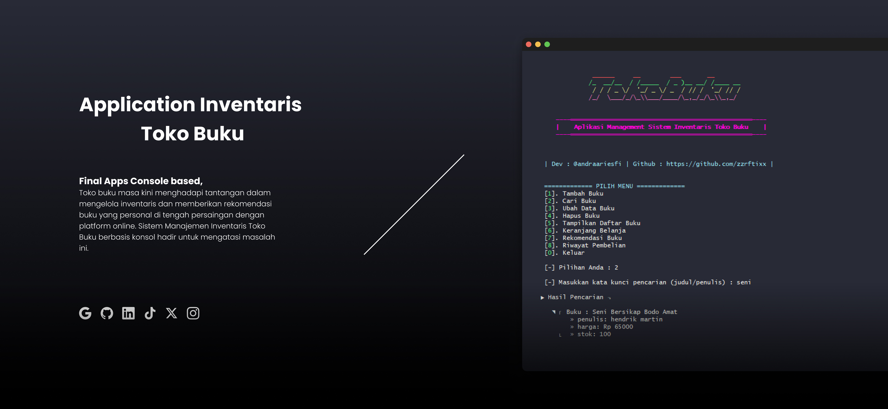

------------------------------------
<p align="center">
  <h2 align="center">FinalProject - Apps Console Inventaris</h2>
  <p align="center">
    Aplikasi ini di buat untuk Final Project Poliwangi
    <br/>
    <br/>
    <a href="https://github.com/zzrftixx"><strong>» Muhammad Andra Ariesfi »</strong></a>
    <br/>
  </p>
</p>
<p align="center">
<a href="https://github.com/zzrftixx"></a> <a href="https://github.com/zzrftixx"></a>
<p>
<p>
Toko buku masa kini menghadapi tantangan dalam mengelola inventaris dan memberikan rekomendasi buku yang personal di tengah persaingan dengan platform online. Sistem Manajemen Inventaris Toko Buku berbasis konsol hadir untuk mengatasi masalah ini. Aplikasi ini memungkinkan pemilik toko buku untuk mencatat stok buku secara digital, melacak ketersediaan, dan membuat keputusan pembelian yang lebih tepat. Fitur rekomendasi buku yang didasarkan pada riwayat pembelian pelanggan juga meningkatkan pengalaman berbelanja dan mendorong penjualan. Dengan antarmuka yang sederhana, aplikasi ini menjadi solusi praktis bagi toko buku untuk meningkatkan efisiensi operasional dan pelayanan pelanggan, serta tetap bersaing di pasar yang kompetitif.
</p>

# Dart command-line application [](https://travis-ci.org/daggerok/dart-console-app-example) 
Sistem Manajemen Inventaris Toko Buku dengan Fitur Rekomendasi ini bertujuan untuk memberikan solusi praktis bagi pemilik toko buku independen dalam mengelola stok buku mereka secara efisien. Dengan antarmuka berbasis konsol yang mudah digunakan, aplikasi ini memungkinkan pencatatan detail buku, pemantauan stok secara real-time, dan pengambilan keputusan yang lebih tepat terkait pembelian buku.
Selain itu, aplikasi ini juga bertujuan untuk meningkatkan pengalaman pelanggan dengan menyediakan fitur rekomendasi buku yang personal. Dengan memanfaatkan data riwayat pembelian, aplikasi ini dapat menyarankan buku-buku yang relevan dengan minat masing-masing pelanggan, sehingga mendorong penjualan dan meningkatkan loyalitas pelanggan.
Secara keseluruhan, tujuan dari aplikasi ini adalah untuk membantu toko buku independen tetap bersaing di era digital dengan meningkatkan efisiensi operasional, memberikan layanan yang lebih baik kepada pelanggan, dan menciptakan pengalaman berbelanja yang lebih personal.

Created from templates made available by Stagehand under a BSD-style
[license](https://github.com/dart-lang/stagehand/blob/master/LICENSE).

## Instalation !!
- Pastikan mempunyai dart SDK
- Anda bisa run pada file main.dart
- Jika Tidak Fitur Error buat Issues

```bash
dart bin/main.dart
# dart run main.dart
```

```bash
run test Application
# dart run bin/source/fullcode_ReEdit.dart
```

### Sedikit Tentang Page ini
- ✔️ | **Application Console** 
- ✔️ | **Fitur Utama dan Implementasi Concept Data Structure** 

1. Menambahkan Buku (List & Map):
Deskripsi: Memungkinkan pengguna (pemilik toko buku) untuk menambahkan informasi buku baru ke dalam inventaris. Informasi yang dimasukkan meliputi judul, penulis, harga, dan stok awal.
Implementasi:
List (daftarBuku): Menyimpan data buku dalam bentuk objek Buku. Setiap objek Buku memiliki atribut judulBuku, penulisBuku, hargaBuku, dan stokBuku.
Map (tidak digunakan secara eksplisit): Meskipun tidak ada map yang terlihat dalam fungsi tambahBuku, setiap objek Buku secara konseptual dapat dianggap sebagai map dengan kunci berupa nama atribut (misalnya, "judulBuku") dan nilai berupa data buku yang sesuai.

2. Mencari Buku (List):
Deskripsi: Memungkinkan pengguna mencari buku dalam inventaris berdasarkan judul atau penulis.
Implementasi:
List (daftarBuku): Digunakan untuk menyimpan daftar buku.
Linear Search: Metode cariBuku() melakukan pencarian linear pada list daftarBuku untuk menemukan buku yang sesuai dengan kata kunci pencarian.

3. Mengubah Data Buku (List):
Deskripsi: Memungkinkan pengguna mengubah informasi buku yang sudah ada dalam inventaris, seperti harga atau stok.
Implementasi:
List (daftarBuku): Digunakan untuk menyimpan daftar buku.
Linear Search (implisit): Metode firstWhere() digunakan untuk mencari buku berdasarkan judul. Meskipun bukan linear search murni, metode ini melakukan iterasi pada list untuk menemukan buku yang sesuai.

4. Menghapus Buku (List):
Deskripsi: Memungkinkan pengguna menghapus buku dari inventaris.
Implementasi:
List (daftarBuku): Digunakan untuk menyimpan daftar buku.
removeWhere(): Metode ini digunakan untuk menghapus buku dari daftarBuku berdasarkan judul.

5. Menampilkan Daftar Buku (List):
Deskripsi: Menampilkan daftar semua buku yang ada dalam inventaris, termasuk judul, penulis, harga, dan stok.
Implementasi:
List (daftarBuku): Digunakan untuk menyimpan daftar buku.
Iterasi dan Tampilan: Melakukan iterasi pada daftarBuku dan mencetak informasi setiap buku.

6. Menambahkan Buku ke Keranjang (List):
Deskripsi: Memungkinkan pengguna menambahkan buku ke keranjang belanja.
Implementasi:
List (keranjang): Digunakan untuk menyimpan daftar buku dalam keranjang belanja. Setiap elemen dalam list adalah sebuah map yang berisi objek Buku dan jumlahnya.

7. Menghapus Buku dari Keranjang (List):
Deskripsi: Memungkinkan pengguna menghapus buku terakhir yang ditambahkan ke keranjang belanja.
Implementasi:
List (keranjang): Digunakan untuk menyimpan daftar buku dalam keranjang belanja.
Penghapusan dari List: Metode removeLast() digunakan untuk menghapus elemen terakhir (buku yang terakhir ditambahkan) dari list keranjang.

8. Checkout (List, Map):
Deskripsi: Menyelesaikan proses pembelian buku-buku dalam keranjang belanja.
Implementasi:
List (keranjang): Digunakan untuk menyimpan daftar buku dalam keranjang belanja.
Map: Setiap elemen dalam keranjang adalah sebuah map yang berisi informasi tentang buku dan jumlahnya.
Perhitungan Total Harga: Menghitung total harga buku-buku dalam keranjang.
Pengurangan Stok: Mengurangi stok buku yang dibeli dalam daftarBuku.
Pencatatan Riwayat Pembelian: Menambahkan informasi pembelian ke dalam riwayat.
Pengosongan Keranjang: Menghapus semua buku dari keranjang.

9. Rekomendasi Buku (List & Map):
Deskripsi: Memberikan rekomendasi buku kepada pelanggan berdasarkan riwayat pembelian mereka.
Implementasi:
List (daftarBuku): Digunakan untuk menyimpan daftar buku.
Map (penulisFrekuensi): Digunakan untuk menghitung frekuensi kemunculan setiap penulis dalam riwayat pembelian.
List (rekomendasi): Menyimpan daftar buku yang direkomendasikan.

10. Menampilkan Riwayat Pembelian (List):
Deskripsi: Menampilkan daftar riwayat pembelian pelanggan.
Implementasi:
List (riwayat): Digunakan untuk menyimpan daftar riwayat pembelian.
Iterasi dan Tampilan: Melakukan iterasi pada riwayat dan menampilkan informasi setiap pembelian.

- ✔️ | **Concept Data Structure** 

List (Daftar):
Konsep: Struktur data yang menyimpan elemen-elemen secara berurutan.
Implementasi dalam Kode:
daftarBuku: Menyimpan daftar objek Buku yang merepresentasikan inventaris buku.
hasilPencarian: Menyimpan daftar objek Buku yang cocok dengan hasil pencarian.
keranjang: Menyimpan daftar item dalam keranjang belanja (setiap item adalah sebuah map).
riwayat: Menyimpan daftar riwayat pembelian (setiap elemen adalah sebuah map).
Keuntungan:
Memudahkan penyimpanan dan pengelolaan data buku, riwayat pembelian, dan item dalam keranjang belanja.
Memungkinkan akses cepat ke elemen berdasarkan indeks.
Mudah digunakan untuk iterasi (perulangan) untuk menampilkan atau mengolah data.
Map (Peta/Kamus):
Konsep: Struktur data yang menyimpan pasangan kunci-nilai (key-value pairs).
Implementasi dalam Kode:
Elemen-elemen dalam keranjang dan riwayat adalah map yang berisi informasi tentang buku dan jumlahnya, atau detail pembelian.
penulisFrekuensi: Map yang menyimpan frekuensi kemunculan setiap penulis dalam riwayat pembelian.
Keuntungan:
Memungkinkan penyimpanan data yang terstruktur dengan kunci yang mudah diidentifikasi (misalnya, "judulBuku", "penulis", "harga").
Akses cepat ke nilai berdasarkan kunci.
Berguna untuk menghitung frekuensi kemunculan penulis dalam rekomendasi buku.
Linear Search (Pencarian Linear):
Konsep: Algoritma pencarian sederhana yang memeriksa setiap elemen dalam daftar secara berurutan.
Implementasi dalam Kode:
Digunakan secara implisit dalam fungsi cariBuku() dan kurangiStok() untuk mencari buku dalam list daftarBuku.
Keuntungan:
Mudah diimplementasikan dan dipahami.
Cukup efisien untuk daftar buku yang relatif kecil.


<div align="center">
  <h2>Let's make an annoyance free better open internet, altogether!</h2>
  <sub>A project by <a href="https://github.com/zzrftixx" target="_blank">Muh Andra Ariesfi</a> Dev <pub>
</div>


